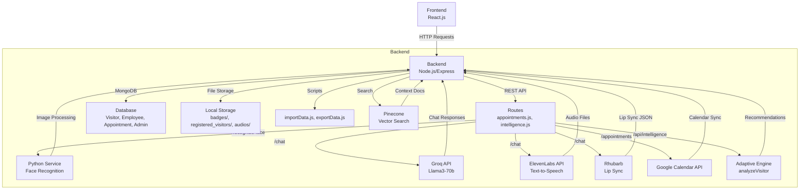

# Projet Avatar IA Interactif - Backend

## 🏛️ Architecture



## 📖 Description

Ce dépôt contient le code source du **backend** pour le projet **Avatar IA Interactif pour Accueil Intelligent**, conçu pour automatiser et humaniser l'accueil physique en entreprise via un avatar IA. Le backend gère la logique métier, incluant la reconnaissance faciale, l'enregistrement des visiteurs, la génération de badges, l'IA conversationnelle, et la gestion des rendez-vous.

Ce backend alimente le frontend [](https://github.com/Abirgharbi/final-virtual-avatar-frontend) via des endpoints API RESTful. Il intègre des services externes comme ElevenLabs pour la synthèse vocale, Groq pour l'IA conversationnelle, Pinecone pour la recherche vectorielle, et Google Calendar pour la gestion des rendez-vous.

## 🎯 Objectifs du Projet

- **Automatisation** : Identifier les employés/visiteurs via reconnaissance faciale et enregistrer les visites.
- **Personnalisation** : Fournir des réponses contextuelles via IA conversationnelle et des recommandations adaptatives.
- **Sécurité** : Journaliser les visites.
- **Intégration** : Synchroniser avec des systèmes externes (Google Calendar, IA externe).
- **Évolutivité** : Supporter des fonctionnalités premium (statistiques).

## 🚀 Fonctionnalités Principales

### Reconnaissance et Enregistrement
- **Reconnaissance faciale** : Endpoint `/recognize-face` pour identifier les employés/visiteurs via un service Python externe (`http://localhost:5000/recognize`).
- **Enregistrement visiteur** : Endpoint `/register-visitor` pour capturer les données (nom, photo, email) et générer un badge PDF avec QR code.
- **Check-out** : Endpoint `/check-out` pour enregistrer la fin des visites.
- **Import/Export données** : Scripts `importData.js` et `exportData.js` pour gérer les données des visiteurs/employés dans MongoDB et Pinecone.

### Gestion des Données
- **Base de données** : MongoDB pour stocker les visiteurs (`Visitor`), employés (`Employee`), administrateurs (`Admin`), et rendez-vous (`Appointment`).
- **Statistiques** : Endpoint `/api/visitors` pour analyser les visites (horaires, départements, tendances).
- **Recherche vectorielle** : Pinecone pour rechercher des informations contextuelles (ex. localisation des employés).

### Intégrations
- **IA conversationnelle** : Endpoint `/chat` utilise Groq (Llama3-70b) pour des réponses naturelles, avec ElevenLabs pour la synthèse vocale et Rhubarb pour la synchronisation labiale.
- **Rendez-vous** : Endpoint `/appointments/book` synchronise avec Google Calendar pour réserver des créneaux.
- **Analyse adaptative** : Endpoint `/api/intelligence/analyze` (non utilisé actuellement) pour des recommandations basées sur l'historique des visites.

## 🗂️ Structure du Projet

- **index.js** : Point d'entrée principal, configure Express, MongoDB, et les routes principales (`/recognize-face`, `/register-visitor`, `/chat`, `/check-out`, `/api/visitors`, `/api/login`).
- **routes/** :
  - `appointments.js` : Gère les endpoints pour la disponibilité (`/availability`) et la réservation de rendez-vous (`/book`) avec Google Calendar.
  - `intelligence.js` : Endpoint `/analyze` pour l'analyse adaptative des visiteurs (non utilisé).
- **models/** :
  - `Visitor.js` : Schéma pour les visiteurs (nom, email, historique des visites).
  - `Employee.js` : Schéma pour les employés (nom, email, localisation).
  - `Appointment.js` : Schéma pour les rendez-vous (email employé, visiteur, horaires).
  - `Admin.js` : Schéma pour les administrateurs (authentification).
- **services/** :
  - `adaptiveEngine.js` : Logique pour analyser les visiteurs (perspective future).
- **utils/** :
  - `embedText.js` : Génère des embeddings pour Pinecone (RAG).
- **scripts/** :
  - `exportData.js` : Exporte les données des employés, visiteurs, et rendez-vous vers Pinecone.
  - `importData.js` : Importe les données des visiteurs depuis un CSV vers MongoDB.
- **badges/** : Répertoire pour stocker les badges PDF générés.
- **registered_visitors/** : Répertoire pour les photos des visiteurs.
- **audios/** : Répertoire pour les fichiers audio et JSON de synchronisation labiale.

## 🛠️ Technologies Utilisées

- **Framework** : Node.js, Express.js
- **Base de données** : MongoDB
- **Reconnaissance faciale** : Service Python externe (via `http://localhost:5000`)
- **IA conversationnelle** : Groq (Llama3-70b-8192), ElevenLabs (synthèse vocale), Rhubarb (synchronisation labiale)
- **Recherche vectorielle** : Pinecone
- **Rendez-vous** : Google Calendar API
- **Authentification** : JWT, bcrypt
- **Autres** :
  - Multer (upload d'images)
  - PDFKit (génération de badges)
  - QRCode (génération de QR codes)
  - FFmpeg (conversion audio)

## 📦 Installation

1. Clonez le dépôt :
```bash
git clone https://github.com/Abirgharbi/final-virtual-avatar-backend.git
```

2. Installez les dépendances :
```bash
cd final-virtual-avatar-backend
npm install
```

## 🚀 Usage 
Lancez l'application en mode développement :
```bash
yarn dev 
```

## 📋 Guide pour l'Encadrant
Tests :
- Reconnaissance faciale : Testez /recognize-face avec une image (POST avec fichier image).
- Enregistrement visiteur : Testez /register-visitor (POST avec firstName, lastName, email, photo, purpose).
- Check-out : Testez /check-out (POST avec email).
- IA conversationnelle : Testez /chat (POST avec message, name, language).
- Rendez-vous : Testez /appointments/availability (GET) et /appointments/book (POST).
- Statistiques : Testez /api/visitors (POST avec dateRange) pour les analyses.
- Authentification : Testez /api/login (POST avec email, password).
